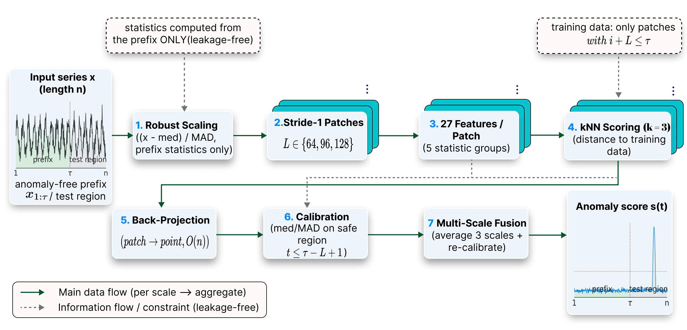

# AASP-UML

A label-free, CPU-only **statistical patch** baseline for univariate time-series
anomaly detection on **TSB-AD-U**.

## Abstract

Recent studies on univariate time-series anomaly detection increasingly rely on
self-supervised neural representations such as transformers and foundation
models, even though rigorous benchmarks show that simpler statistical methods
remain competitive. AASP-UML is a **label-free** detector that describes
overlapping patches with **27 statistical features**, scores them by
**k-nearest-neighbor** distance to patches drawn from the anomaly-free training
prefix, and **fuses evidence across three temporal scales**. Every normalization
and calibration statistic is restricted to the training prefix, so the pipeline
is **leakage-free** by construction, and evaluation follows the official
TSB-AD-U VUS-PR procedure. The method uses no anomaly labels and no neural
networks and runs entirely on CPU. On the public 350-series TSB-AD-U evaluation
split it reaches a mean VUS-PR of **0.648**.



The detector is seven deterministic operations: robust prefix scaling, stride-1
patch extraction, 27-feature description, kNN scoring, `O(n)` back-projection,
safe-prefix calibration, and multi-scale fusion over `L ∈ {64, 96, 128}`.

## Installation

Clone the repository and set up the environment as follows:

```bash
# Make conda environment
conda create -n aasp-uml python=3.11 -y
conda activate aasp-uml

# Install dependencies
pip install -r requirements.txt
```

`requirements.txt` pulls `TSB_AD==1.5`, which provides the official VUS-PR metric.
If pip cannot resolve it, clone the official repository and expose it on
`PYTHONPATH`:

```bash
git clone https://github.com/TheDatumOrg/TSB-AD external/TSB-AD
export PYTHONPATH="src:external/TSB-AD"   # PowerShell: $env:PYTHONPATH = "src;external\TSB-AD"
```

## Quick Start

Once dependencies are installed and the data is in place (see below), score a
split with a single command:

```bash
export PYTHONPATH="src"                    # PowerShell: $env:PYTHONPATH = "src"

# k-nearest-neighbor branch (primary)
python -m aasp_ad.run_aasp_eval --method knn --split eva350

# Isolation Forest branch
python -m aasp_ad.run_aasp_eval --method iforest --split eva_full822
```

Each run writes a per-series VUS-PR CSV under `outputs/results/` with an explicit
protocol marker (`eval_protocol = TSB_AD_find_length_rank_opt_250`), the
per-series `sliding_window`, and per-series `status`/`error` fields.

## Dataset

Please download the official TSB-AD-U univariate CSV files from
<https://github.com/TheDatumOrg/TSB-AD> and move them to:

```text
data/raw/TSB-AD-U/
```

The small split lists committed in `data/*.csv` define the exact series used by
each split (`eva350`, `eva_full822`, `tuning`). The raw benchmark data itself is
not redistributed here.

## The 27 patch features

For every stride-1 patch, AASP-UML computes 27 descriptors in five groups
(full formulas in the source):

| Group | Dim. | Features |
|-------|------|----------|
| Amplitude | 12 | mean, std, min, max, range, q25, q75, iqr, mad, robust 3rd/4th moment, rms |
| Shape | 2 | instance-normalized skewness, kurtosis |
| Temporal | 10 | net slope, mean/std/max-abs first difference, ZCR, MCR, acf1, acf2, acf5, CUSUM max-deviation |
| Spectral | 2 | spectral entropy, dominant frequency ratio |
| Trend | 1 | linear trend |

## Project Structure

```text
AASP-UML/
├── assets/
│   └── architecture.png          # for README.md
├── data/
│   ├── TSB-AD-U-Eva.csv           # public split lists (raw data downloaded separately)
│   ├── TSB-AD-U-Eva-Full.csv
│   └── TSB-AD-U-Tuning.csv
├── notebooks/
│   ├── 01_EDA.ipynb               # exploratory data analysis
│   └── eda_tsb_ad_u/run_all_eda.py
├── outputs/eda/
│   ├── tables/                    # committed EDA tables
│   └── figures/                   # committed EDA figures
├── src/aasp_ad/
│   ├── config.py                  # reproducible paths and split loading
│   ├── unsupervised_patch.py      # patch features and kNN / iForest scorers
│   ├── run_aasp_eval.py           # model evaluator (VUS-PR, leakage-free)
│   ├── eda_features.py            # meta-feature extraction
│   ├── profile.py                 # per-series profiling
│   ├── integrity.py               # dataset integrity checks
│   └── figures.py                 # figure generation
├── tools/                         # split-safety guard and hygiene checks
├── requirements.txt
└── README.md
```

## Exploratory data analysis

- `notebooks/01_EDA.ipynb` — interactive EDA of TSB-AD-U.
- `notebooks/eda_tsb_ad_u/run_all_eda.py` — regenerates the committed EDA tables
  and figures under `outputs/eda/`.

## Reproducibility

Paths are derived relative to the repository (via `pathlib`), so the project runs
after a fresh clone without editing any absolute paths. All model normalization
and calibration statistics are fitted on the training prefix only; a fail-closed
guard rejects series whose prefix is too short. TSB-AD-U is publicly available
from its authors (<https://github.com/TheDatumOrg/TSB-AD>).
